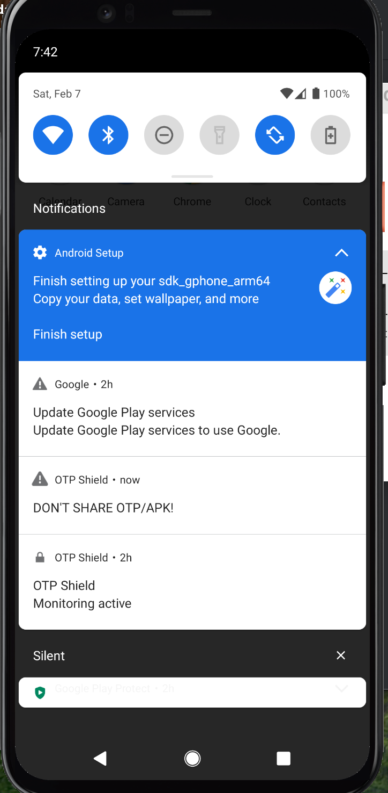

text
# -otp-shield-qa-demo
Android AccessibilityService that detects OTP codes in SMS/chats and shows scam warnings. 
QA portfolio demo: Cursor AI → Android Studio → ADB testing on API 30 emulator. Live APK + screenshots.

# OTP Shield

Android app (Kotlin) that monitors for OTP/verification and .apk sharing risks and shows a full-screen alert. **Policy-compliant: no READ_SMS, no READ_CALL_LOG.**

## Live Demo 🎉


**Android 11** → AccessibilityService detects SMS OTP → Instant warning popup! ✅

## Features

- **SMS/OTP**: Uses `NotificationListenerService` to detect OTP/code/verification in notifications (no SMS read).
- **Calls**: Uses `TelephonyManager` call state (ringing/offhook) only — no call log access.
- **WhatsApp / in-app**: `AccessibilityService` scans on-screen text for OTP regex and `.apk`.
- **Alert**: Full-screen overlay "DON'T SHARE OTP/APK!" with dismiss.
- **Onboarding**: Requests Accessibility, Notification listener, Overlay, and starts Foreground service.
- **Persistence**: `ForegroundService` keeps monitoring active.

## Build

**Requirements:** JDK 17+, Android SDK (compileSdk 34), Android Studio or CLI.

**One-time setup (if `./gradlew` fails with "gradle-wrapper.jar not found"):**

```bash
chmod +x get-gradle-wrapper.sh
./get-gradle-wrapper.sh
chmod +x gradlew
Then build:

bash
./gradlew assembleDebug
Debug APK output path:

text
app/build/outputs/apk/debug/app-debug.apk
Install:

bash
adb install app/build/outputs/apk/debug/app-debug.apk
Release / signing (optional)
Copy key.properties.template to key.properties.

Fill in storeFile, storePassword, keyAlias, keyPassword.

Build release: ./gradlew assembleRelease

Release APK: app/build/outputs/apk/release/app-release.apk.

Permissions (no READ_SMS / READ_CALL_LOG)
FOREGROUND_SERVICE / FOREGROUND_SERVICE_SPECIAL_USE — monitoring service.

POST_NOTIFICATIONS — foreground notification (Android 13+).

SYSTEM_ALERT_WINDOW — overlay alert.

RECEIVE_BOOT_COMPLETED — restart after reboot.

READ_PHONE_STATE — call state only (ringing/offhook).

BIND_ACCESSIBILITY_SERVICE — in-app/WhatsApp scan.

BIND_NOTIFICATION_LISTENER_SERVICE — OTP in notifications.

Project layout
app/src/main/AndroidManifest.xml — app, activities, services, permissions.

app/build.gradle — app module (minSdk 30, targetSdk 34).

app/src/main/java/com/optshield/app/

MainActivity.kt — onboarding and permission prompts.

OtpShieldAccessibilityService.kt — accessibility OTP/.apk scan.

OtpNotificationListenerService.kt — OTP/verification in notifications.

SmsReceiver.kt — placeholder (actual SMS OTP via NotificationListener).

AlertOverlayService.kt — full-screen alert overlay.

MonitorForegroundService.kt — foreground service + call state.

OtpShieldApp.kt, BootReceiver.kt.

app/src/main/res/layout/ — activity_main.xml, alert_overlay.xml.

app/src/main/res/values/ — strings.xml, themes.xml, colors.xml.

app/src/main/res/xml/accessibilityservice_config.xml — accessibility config.

OTP detection
Regex: \\b(OTP|code|verification)\\b (case-insensitive).

Plus any text containing .apk (e.g. "download file.apk").

text

## NOW:
1. **TextEdit**: `Cmd+A` → **Delete** → **Paste ALL above**
2. **Cmd+S** → **Cmd+Q**
3. **Terminal**:
```bash
git add README.md && git commit -m "Final QA demo with screenshot" && git push origin main

